<p align="center">
  
</p>

<p align="center">
  <a href="https://nextjs.org"></a>
  <a href="https://www.typescriptlang.org"></a>
  <a href="https://react.dev"></a>
  <a href="https://tailwindcss.com"></a>
  <a href="https://clerk.com"></a>
  <a href="https://www.prisma.io"></a>
  <a href="https://supabase.com"></a>
  <a href="https://www.inngest.com"></a>
  <a href="https://deepgram.com"></a>
  <a href="https://ai.google.dev"></a>
  <a href="https://www.arcjet.com"></a>
  <a href="https://ffmpeg.org"></a>
</p>

<h1 align="center">KINETIC — AI Video → Viral Shorts Engine</h1>

<p align="center">
  Turn long-form video into platform-ready short clips with AI-selected moments,
  word-by-word subtitles, and one-click multi-platform publishing — all rendered
  server-side and streamed back from your own domain.
</p>

---

## Features

- **AI moment selection** — Gemini analyses the transcript and picks the highest-retention hooks.
- **Automatic transcription** — Deepgram converts speech to timed words for captions.
- **Server-side rendering** — FFmpeg burns in subtitles, trims, and exports MP4 in a background job (no browser timeouts).
- **Background jobs** — Inngest orchestrates transcription → AI selection → render → publish with retries.
- **Same-origin downloads** — rendered clips are streamed through `/api/video/download`, never exposing storage URLs.
- **Prompt-injection guard** — Arcjet scans untrusted transcript text before it reaches the model.
- **Multi-platform publishing** — connect TikTok/Instagram/YouTube via Zernio and schedule posts.
- **Auth & DB** — Clerk for authentication, Prisma + Postgres (Supabase) for persistence.
- **Polished dark UI** — Tailwind CSS v4 design system with a precision "midnight" aesthetic.

## Architecture

```mermaid
flowchart LR
  A[Upload Video] --> B[Storage: Supabase / S3]
  B --> C[Inngest: process-video]
  C --> D[Deepgram: Transcribe]
  D --> E[Arcjet Guard: scan transcript]
  E --> F[Gemini: select moments]
  F --> G[GeneratedShort: QUEUED]
  G --> H[Inngest: render-short]
  H --> I[FFmpeg: burn subtitles + trim]
  I --> J[Upload MP4 → Storage]
  J --> K[GeneratedShort: READY]
  K --> L[Stream via /api/video/download]
```



All heavy work runs as **Inngest functions**, so HTTP requests stay fast and the
1–2 minute FFmpeg render never hits a serverless timeout.

## Tech Stack

| Layer        | Technology |
|--------------|------------|
| Framework    | Next.js 16 (App Router) + React 19 |
| Language     | TypeScript 5 |
| Styling      | Tailwind CSS v4, Base UI, lucide-react |
| Auth         | Clerk |
| Database     | PostgreSQL via Prisma (Supabase) |
| Background   | Inngest |
| Transcription| Deepgram |
| AI / Captions| Google Gemini |
| Storage      | Supabase Storage **or** S3-compatible (AWS / Neon / R2 / MinIO) |
| Video        | FFmpeg (`@ffmpeg-installer/ffmpeg` + `fluent-ffmpeg`) |
| Security     | Arcjet (prompt-injection guard) |
| Publishing   | Zernio (optional, social platforms) |

## Prerequisites

- **Node.js** ≥ 18 (tested on v23)
- A **PostgreSQL** database (Supabase project recommended)
- API keys for **Clerk, Deepgram, Gemini, Arcjet**
- Either **Supabase Storage** or an **S3-compatible** bucket
- (Optional) **Inngest** account + **Zernio** key for social publishing

## Getting Started

1. **Install dependencies**

   ```bash
   npm install
   ```

2. **Configure environment**

   Copy the template and fill in your keys:

   ```bash
   cp .env.example .env.local
   ```

   See [`.env.example`](./.env.example) for the full list of variables.

3. **Set up the database**

   ```bash
   npx prisma generate
   npx prisma db push
   ```

4. **Run the dev servers** (app + Inngest worker)

   ```bash
   # Terminal 1 — Next.js
   npm run dev

   # Terminal 2 — Inngest dev server (processes background jobs)
   npx inngest-cli dev
   ```

5. Open <http://localhost:3000> and sign in with Clerk.

## How it works (code)

### 1. Queue a render (fire-and-forget)

`app/api/video/export/route.ts` only enqueues an Inngest event and returns
immediately — the UI polls status while the render runs in the background.

```ts
await inngest.send({ name: "short/render.requested", data: { shortId } });
return NextResponse.json({ success: true, status: "QUEUED" });
```

### 2. Render + guard (Inngest function)

`lib/inngest/functions/render-short.ts` runs FFmpeg and stores the resulting
path (not a short-lived signed URL). The transcription step in
`video-process.ts` scans untrusted text with Arcjet **before** it reaches Gemini:

```ts
import { launchArcjet, detectPromptInjection } from "@arcjet/guard/node";
import { arcjetGuard, promptInjectionRule } from "@/lib/arcjet-guard";

const decision = await arcjetGuard.protect({ ... }, promptInjectionRule, transcript);
if (decision.isDenied()) {
  // fail open to a safe fallback — never block legitimate content
}
```

### 3. Stream the download from your own domain

`app/api/video/download/route.ts` fetches the file from storage and relays it
as a same-origin attachment, so users never see a `supabase.com` link:

```ts
const upstream = await fetch(sourceUrl);
return new Response(upstream.body, {
  headers: {
    "Content-Type": "video/mp4",
    "Content-Disposition": `attachment; filename="${filename}"`,
  },
});
```

## Project Structure

```
app/
  (auth)/            Clerk sign-in / sign-up routes
  api/
    video/           export · status · download · dispatch
    social/          connect · callback · schedule (Zernio)
    inngest/         Inngest webhook receiver
  dashboard/         Studio UI, project workspace, scheduler
components/          UI components + design-system primitives
lib/
  arcjet-guard.ts    Arcjet prompt-injection guard
  ffmpeg.ts          Render pipeline (subtitles + trim + encode)
  inngest/           Workflow functions (process, render, publish)
  supabase.ts/s3.ts  Storage adapters
  gemini.ts/deepgram.ts
prisma/schema.prisma Database models
```

## Cost Breakdown (estimates)

Costs are dominated by AI transcription + model inference and by render compute.
Storage and the orchestration layer are effectively free at indie scale.

| Service      | Pricing model | Est. cost per 10-min video |
|--------------|---------------|----------------------------|
| Deepgram     | ~$0.0043 / min | ~$0.04 |
| Gemini Flash | ~$0.10 / 1M in-tokens | < $0.01 |
| FFmpeg render| Own compute (Inngest / VM) | ~1–2 min CPU |
| Supabase     | Free tier + storage | $0 (small) |
| Inngest      | 10k steps/mo free | $0 (small) |
| Arcjet       | 10M requests/mo free | $0 |
| Zernio       | Per connected platform | varies |

> Note: because rendering is CPU-heavy, run the Inngest worker on a machine with
> multiple cores (or a long-timeout platform). Serverless functions with a
> 60s cap will **not** finish a 1–2 minute render.

## Deployment

### 1. Database & Storage
- Create a Supabase project, copy `DATABASE_URL`, and run `prisma db push`.
- Use Supabase Storage **or** an S3 bucket; set the matching env vars.

### 2. App (Vercel)
```bash
vercel deploy
```
Set **every** variable from `.env.example` in the Vercel project settings.

### 3. Inngest (production)
- Create an Inngest app, copy `INNGEST_EVENT_KEY` + `INNGEST_SIGNING_KEY`.
- Deploy the Inngest worker (a long-running Node service or Vercel background
  function). The `app/api/inngest/route.ts` handler receives events.

### 4. Clerk & Arcjet
- Add your production domains to Clerk.
- Add `ARCJET_KEY` and set the guard environment to `LIVE`.

## Security

- **Prompt-injection protection** — all model-facing text is scanned by Arcjet
  (`@arcjet/guard`) before inference.
- **No leaked storage URLs** — downloads are streamed through your domain.
- **Secrets** — only `.env.example` is committed; real `.env*` files are
  git-ignored.

## Contributing

1. Fork & clone.
2. Copy `.env.example` → `.env.local` and fill keys.
3. Run `npm install`, `prisma db push`, then `npm run dev` + `npx inngest-cli dev`.
4. Open a PR.

## License

MIT — see [LICENSE](./LICENSE) for details.
